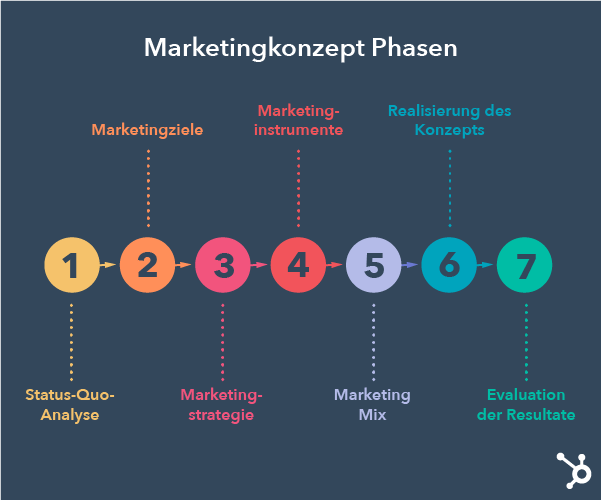

+++
title = "Blogeintrag vom 13. September "
date = "2022-09-13"
draft = false
pinned = false
image = "istockphoto-1160934657-612x612.jpeg"
description = "In diesem Blogeintrag erzähle ich, was in den Lektionen vom 13. September passiert ist. Und was unser nächster Schritt in unserem Projekt ist..."
+++
Im Unterricht vom 13. September haben wir als erstes, individuell ein IKIGAI Test gemacht. In dem Test, der leider etwas zu lange war, wurden viele Fragen zu meinem Verhalten, Stärken, Schwächen und Ähnlichem gefragt. Anschliessend haben wir ein Video zum Geschäftsmodell Lean geschaut und dies kurz besprochen. Anschliessend haben wir unsere Projekte der Klasse präsentiert. Nun haben Luciano und ich den nächsten Schritt unseres Projektes besprochen. Luciano und ich sind zum Entschluss gekommen, dass unser nächster Schritt ist und zu überlegen, wie wir unser Produkt vermarkten wollen. Wir müssen und eine Marketing Strategie überlegen und herausfinden, wie wir unser Produkt am besten an unsere Kunden bringen. Unsere Leitfrage lautet: Mit welchen Mitteln bringen wir unsere Produkte an unsere Zielgruppe?

